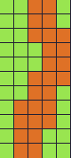
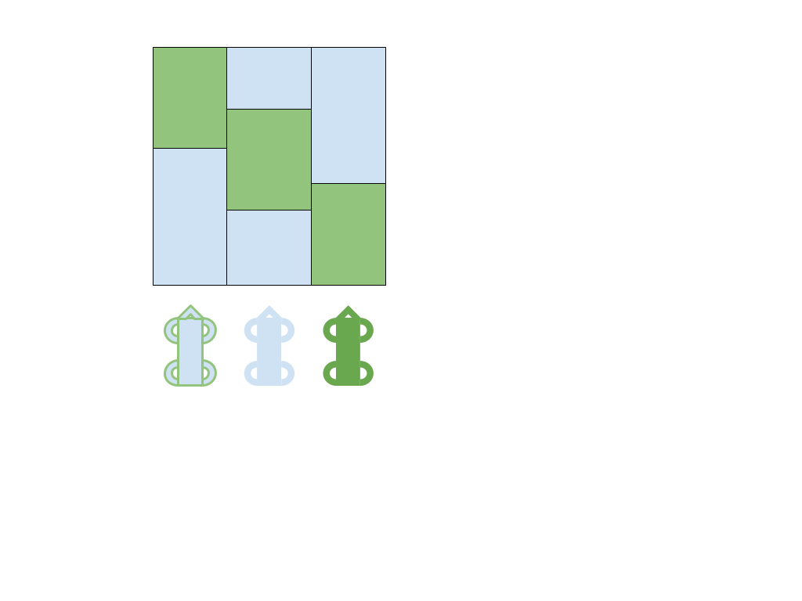

# Godot Jam June 2016 Design (draft doc)
_Primary Theme: Procedural_

_Secondary bonus Theme: Two-color_

## Broad concept
- Solo endless race game
- 3D models viewed from overhead to give 2.5D feel
- Top-down or partially isometric view
- Horizontal or vertical scrolling

## Jam tie-ins
##### Procedural
- Track is generated on-the-fly using patterns
- Patterns are tile-based maps
	- 
- Item pickups will be generated as needed to match pattern but not tied to each pattern

##### Two-color
- Track has two colors
- Vehicle has three color states: Color A, Color B and A/B
	- When on same color, vehicle accelerates
	- When on opposite color, vehicle deccelerates
	- When vehicle is A/B, no change in acceleration
		- Diagram (in [Programmer art](https://en.wikipedia.org/wiki/Programmer_art))

##### Other ideas (to be discussed)
- Track may have multiple lanes
- ~~Track could be solid curves instead of blocks~~
- Vector art aesthetic
- Time limit (60s, 30s, 2m)
- Score based on distance travelled
- Change camera FOV with speed (more speed = more FOV with a limit)
- Mountains? Just for aesthetics. If so, we could make them with a heightmap, and even modify their height with speed.

